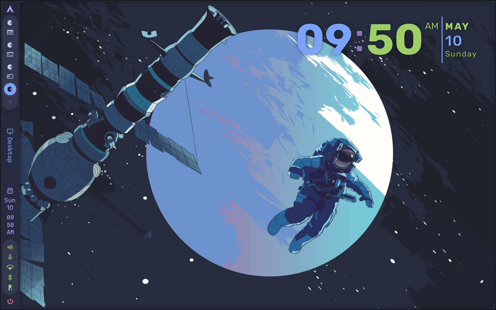
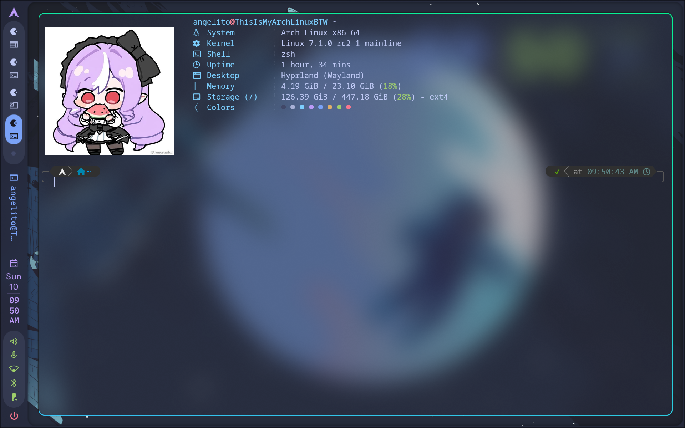
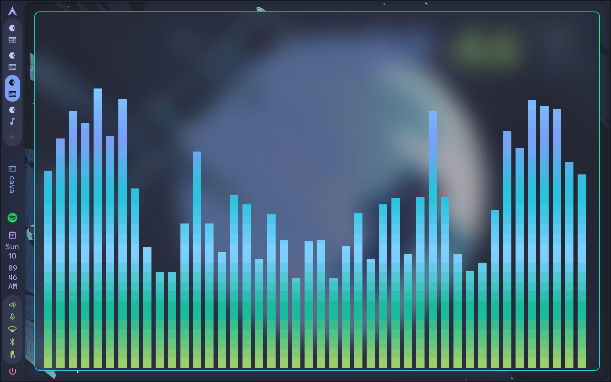
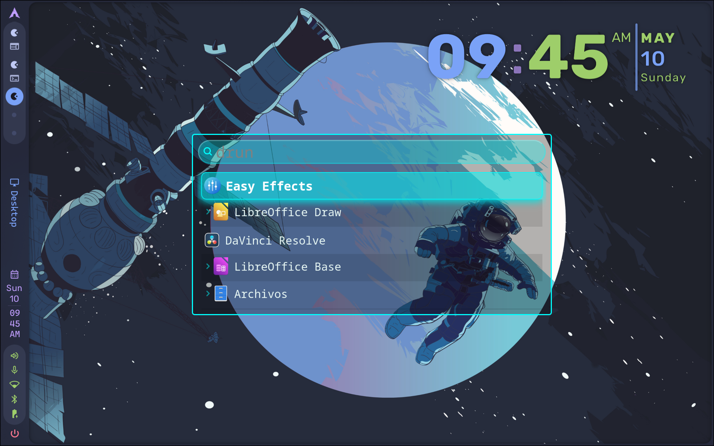

## Leer antes de instalar :3 

Buenas gente, perdon si son de habla no hispana pero todavia estoy en ese proceso :3 así que, no desesperen gente, ya arreglaré eso, acalaro que esto es solo para Arch + Caelestia shell, aunque tambien puede ser usado en cualquier otra distro basada en arch, principalmente por Caelestia-Shell que actualmente solo está en Arch

Este repo es sobre mi config personal de Dotfiles, lo que he hecho en esta ultima semana volviendo a Arch Linux, aquí les dejo un par de referencias de como va a quedar su sistema:

Aqui está una vista general de mi entorno Hyprland:

Pero para que funcione deben tener instaladas las siguientes dependencias

1- Hyprland (obvio)

2- Caelestia-Shell-git

3- Kitty (con Zsh)

4- Oh My Zsh

5- Powerlevel10k

6- Fastfetch

7- ImageMagick

8- Wofi

9- Cava

10- zsh-syntax-highlighting y zsh-autosuggestions

Con esto aclarado, lo unico que tiene que hacer es usar el /.install.sh y ya, debería (digo debería porque la verdad está en desarrollo todavía)
instalarles todo en sus sitema, sigo trabajando en la sustitución de carpetas y todo eso, así que posiblemente tenga errores y bugs que con el tiempo voy a arreglar :3 

## Aquí como va a quedar su terminal de kitty:

Tengan en cuenta que todavía sigo trabajando en el .config de fastfetch así que, por ahora, no va a estar disponible

## Así se va a ver cava:

## y este es wofi:

Gracias por leer :3

ACLARACIÓN:
---
## ⚖️ Licencia

Este proyecto está bajo la licencia **GNU GPL v3.0**. Eres libre de usarlo, modificarlo y distribuirlo, siempre y cuando mantengas la misma licencia.
