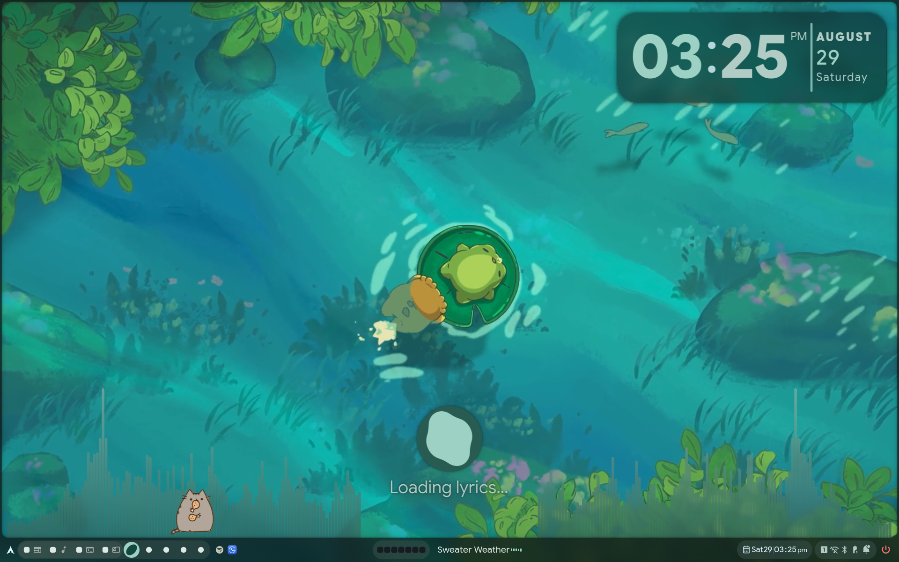
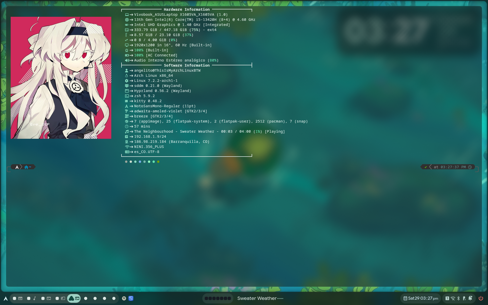
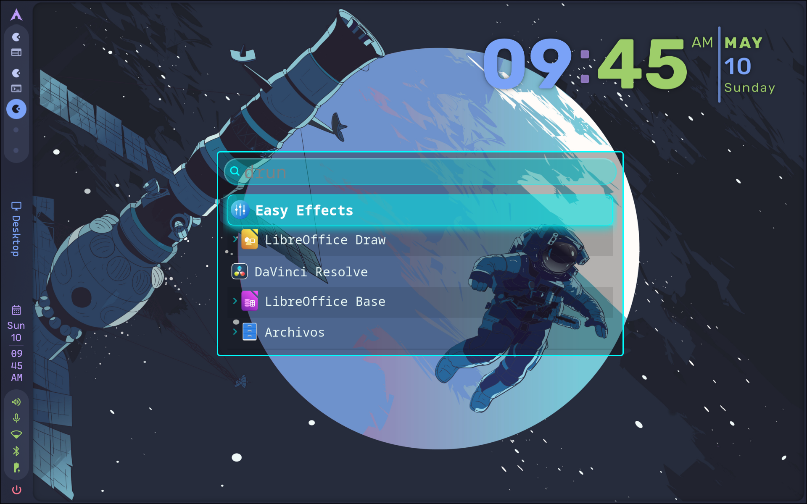

## Leer antes de instalar :3 

Buenas gente, perdon si son de habla no hispana pero todavia estoy en ese proceso :3 así que, no desesperen gente, ya arreglaré eso, acalaro que esto es solo para Arch + Caelestia shell, aunque tambien puede ser usado en cualquier otra distro basada en arch, principalmente por Caelestia-Shell que actualmente solo está en Arch

## AVISO!!!!!!

Esta es la rama dev (desarrollador) de los dotfiles, aviso que no todo puede  funcionar del todo, así que instalarla ya es su descición y no me culpen a mí si algo no funciona (con esto me refiero a hyprmod, que parcialmente está limitado a los .conf normales y si bien hay una forma de hacerlo compatible con los .lua la verdad no lo sugiero mucho),con esto dicho, sigamos:

Este repo es sobre mi config personal de Dotfiles, lo que he hecho en esta ultima semana volviendo a Arch Linux, aquí les dejo un par de referencias de como va a quedar su sistema:

Aqui está una vista general de mi entorno Hyprland:

Pero para que funcione deben tener instaladas las siguientes dependencias

1- Hyprland (obvio)

2- Caelestia-Shell-git

3- Kitty (con Zsh)

4- Oh My Zsh

5- Powerlevel10k

6- Fastfetch

7- ImageMagick

8- Wofi

9- Cava

10- zsh-syntax-highlighting y zsh-autosuggestions

11- Kvantum

12- Qt6ct

## Instalación automatica

Con esto aclarado, lo unico que tiene que hacer es usar el ./install.sh y ya, debería (digo debería porque la verdad está en desarrollo todavía)
instalarles todo en sus sitema, sigo trabajando en la sustitución de carpetas y todo eso, así que posiblemente tenga errores y bugs que, con el tiempo voy a arreglar :3 

## Instalación manual

Baja el .zip desde aquí, o haz un git clone https://github.com/Diamantito-cup/Dofiles_For_Hyprland/tree/dev y luego descomprimelo, dentro encontraras las carpetas de: hypr, wofi, kitty y fastfetch, y el archivo de .zshrc, puedes ignorar la carpeta  de wallpapers y assets, puedes usar la carpeta de Wallpapers como base para tu colección, pero las que vamos a usar son las 5 anteriormente mencionadas y el archivo .zshrc.

Suponiendo que ya tienes instaladas todas las dependencias necesarias, iniciemos por hyprland, abre tu axplorador de archivos (suponiendo que sea Dolphin) y entra a Descargas/Downloads > Dotfiles_For_Hyprland > hypr y dentro de la carpeta hypr copia el archivo hyprland.lua, en la esquina superiro derecha debe estar la opcion de dividir vista, click, te va a abrir otra vista, en la barra de busqueda de esa vista escribe ~/.config/hypr/ dentro de esa carpeta pega el hyprland.lua que copiaste, y si encuentras el anterior .conf, renombralo a hyprland.conf.back, luego windows(super) + M para recargar sesión grafica y debe cargar tu hyprland.lua (ojo, esto solo funciona para las nuevas versiones a partir de la 0.55 que implementan el formato .lua, porque si no, no va a funcionar y te va a mandar a pantalla negra).

Ahora vamos con kitty, abra una terminal (windows(super) + Q) y escriba mkdir -p ~/.config/kitty/ eso creará el ddirectorio necesario, de vuelta a Dolphin, salga de la carpeta hypr de la carpeta Dofiles_For_Hyprland y entra a la carpeta kitty que está ahí mismo (no cierres la vista dividida) y copia el kitty.conf y el current-theme.conf, luego, en la vista dividida, en la barra de busqueda, haz ~/.config/kitty/ y pega los dos archivos que copiaste, luego reinicia todas las terminales y se aplicaran los cambios.

(PD:Escribo esto mientras ando escuchando un meme de Kasane Tetto, JAJAJAJAJAJA)

Vamos con wofi, abre una terminal (windows(super) + Q) y haz mkdir -p ~/.config/wofi/ y eso crea el directorio que necesitamos, entoneces, en Dolphin, sal de la carpeta kitty (la que está dentro de la carpeta Dotfiles_For_Hyprland en Descargas/Downloads) y entra a la carpeta que dice wofi, dentro encontraran una carpeta llamada styles.css, copienla, luego, en la vista diviccida, en la barra de busqueda, escriban ~/.config/wofi/ dentro encontraremos la carpeta vacía, peguen el archivo que copiaron dentro de esa carpeta.

Ahora vamos con fastfetch, abre una terminal (windows(super) + Q) y haz un mkdir -p ~/.config/fastfetch, no es necesario crear config porque nosotros la vamos a generar a mano, luego, en Dolphin, vamos a salir de la carpeta wofi (la que está dentro de Dotfiles_For_Hyprland) y entremos a la carpeta fastfetch, dentro encontraran dos cosas, una carpeta llamada images, que es donde están las imaganes, y un archivo llamad config.jsonc, copia ambas cosas, y en la vista dividida, en la barra de busqueda escribe ~/.config/fastfetc/ la carpeta debe estar vacia, si no, pueden borrar lo que está dentro y pegar lo que habian copiado (la carpeta images y el archivo config.jsonc) y listo :3 

Si se preguntan porque no metí a cava aquí es porque con caelestia  pueden hacer [caelestia scheme set -n dynamic] y su paleta de colores se va a cambiar segun su wallpaper y sobre el archivo de .zshrc pues, solo es copiar su contenido y pegarlo en su .zshrc propio :3

## Aquí como va a quedar su terminal de kitty y fastfetch:

## y este es wofi:

## Repo de HyprMod (parcialmente compatible con .lua)

---> https://github.com/BlueManCZ/hyprmod.git

**Gracias por leer :3**

Si les intereza estoy disponible para peticiones de cambio y reportes de bugs 👍

## ACTUALIZACIÓN

Ahora mismo estoy mejorando el ./install.sh para que descarge las dependencias automaticamente, claro, para esto trendran que tener activado los repositorios AUR de yay (sigo trabajando con que sea compatible con paru :3 )

ACLARACIÓN:
---
## ⚖️ Licencia

Este proyecto está bajo la licencia **GNU GPL v3.0**. Eres libre de usarlo, modificarlo y distribuirlo, siempre y cuando mantengas la misma licencia.
